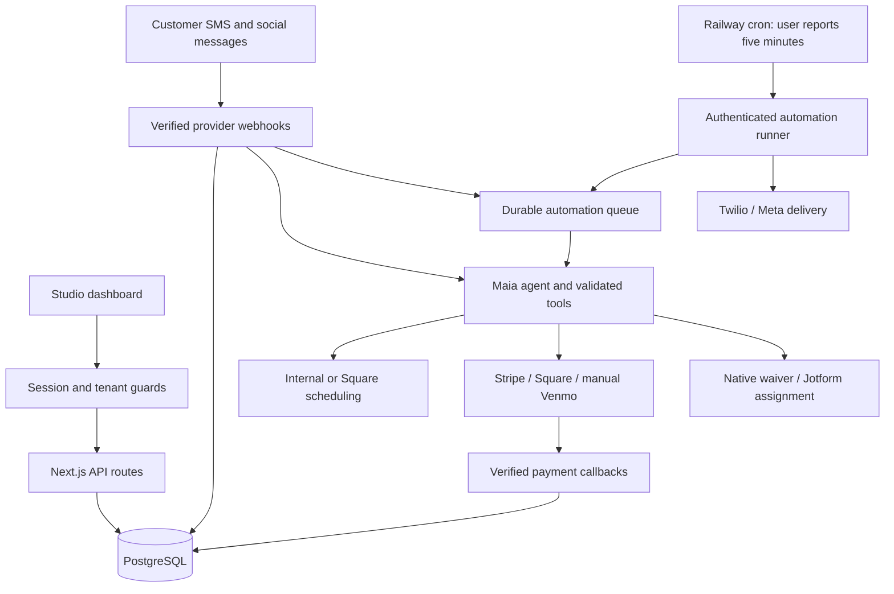

# Maia Front Desk architecture

Audit date: October 8, 2026. Re-audited source commit: `07200a41ab1da8a60c0e4adffba9365c3e4cc4f1`. AGENTS.md was read and applied. This describes inspected implementation, not a certification of the deployed environment. Historical development sprint notes retain their established numbering and are secondary to current code. The separate production-readiness phase in ROADMAP.md uses PR-1 through PR-7.

## System map

Next.js App Router provides dashboard pages, authenticated JSON APIs, public consent/legal surfaces, OAuth callbacks, and provider webhooks. PostgreSQL is accessed through Drizzle and a shared `pg` pool (`packages/db/src/index.ts`). Schema lives in `packages/db/src/schema.ts`; migrations live in `packages/db/drizzle/`, with separate auth SQL in `packages/auth/schema.sql`. The pasted AGENTS.md mentions `db/`; the actual schema directory is `packages/db/`.

## Tenant and authorization model

Organizations own artists, clients, services, conversations, appointments, compliance profiles, provider connections, and jobs. Users have an organization and OWNER or ARTIST role. `packages/auth/server.ts:identity` resolves a hashed, expiring session against active credentials. `protectedRoute` requires authentication, checks mutation Origin, validates known top-level referenced IDs against the session organization, and replaces organization input with the authenticated organization. Owner-only routes cover studio configuration, compliance, provisioning, and integrations. Multipart provisioning uses `protectedFormRoute`.

Artist-level access is additionally enforced in selected endpoints through `canManageAppointment`, `accessibleConversation`, and AI context resolution. It is not a universal guard rule: see A01 in PRODUCTION_READINESS.md. The generic guard does not validate arbitrary nested references or every dynamic path ID; those belong to handler checks. No database RLS policies were found in the inspected repository, and many relationships are single-column foreign keys. Database-role privileges and deployed policies remain unverified.

Public signup uses same-origin validation, database-backed request limits, and one transaction to create studio, owner credentials, default artist, and session. Login is email-based and deliberately refuses duplicate active email matches; signup now serializes normalized email checks and rejects existing identities (A21 local implementation). A prepared, locally tested migration adds a global `lower(btrim(email))` unique index; production application remains unverified. Signup validates timezones and retries slug conflicts. Newly added artist profiles are staff configuration records without a user account provisioning/invitation lifecycle in `app/api/studio/artists/route.ts`. Email verification, self-service recovery, invitation/membership management, and SaaS entitlement enforcement were not found in the inspected routes.

Public exceptions are auth login/signup/session, provider callbacks, the bearer-authenticated automation runner, hosted booking inquiries, and token-scoped external consent ingestion. Waiver signing supports a signed capability bound to organization, appointment, client, template, and expiry. This is an intentional limited public access mechanism.

## Messaging and consent

`app/api/twilio/inbound/route.ts:POST` maps the destination number to a tenant/artist, validates signatures in production, records inbound messages, and handles STOP/HELP/START/YES. Initial inbound messages do not automatically grant subscription consent. `packages/consent/server.ts:hasScopedSmsConsent` checks recorded organization/artist/client/phone evidence; send paths also examine client opt-in state. STOP cancels undelivered queued AI responses.

`packages/integrations/studio-sms.ts:sendStudioSms` centralizes automated studio delivery. Direct SMS testing, manual inbox replies, and immediate inbound replies use separate send paths. These have different approval and consent gates (A04, A06). Status callbacks authenticate the provider, lock message rows, and apply ordered status updates (`app/api/twilio/message-status/route.ts`, `packages/integrations/twilio-message-status.ts`). Provider acceptance and carrier delivery are distinct states.

Meta callbacks verify the raw payload signature, normalize events, and schedule processing with Next.js `after`. `packages/channels/server.ts:processSocialInbound` resolves the connected account, client identity, conversation, and response. Tokens are encrypted; outgoing social responses enforce the reply window in queued/manual flows. `after` is not durable ingress (A05).

Hosted appointment requests store inquiry/consent records after resolving a public organization/form slug and active artist service. They do not create scheduled appointments. No staff inquiry processing/listing route was found (A22). The public form may update an existing client identified only by a phone number (A20). External consent uses a configured hashed integration token, not browser session authorization.

## Twilio and compliance

Provisioning is currently per artist: one unique artist subaccount and Messaging Service; numbers reference both. `createTwilioSubaccount` authenticates the parent Accounts API; subsequent service, number, and campaign calls use subaccount credentials. Tokens use AES-256-GCM encryption.

Compliance intake, published legal documents, generated campaign copy, consent surfaces, and submission gates exist. `startLiveRegistration` creates secondary customer profile business/representative/address entities, assigns the configured Primary Customer Profile SID, evaluates, and submits. `syncLiveRegistration` advances approved customer profiles to A2P TrustProducts, brands, and per-service campaigns. Compliance identity and brand artifacts are stored once per organization, using the first active service's account. That conflicts with multi-artist account ownership (T01). Detailed lifecycle and fixes are in TWILIO_ISV_AUDIT.md.

The status endpoint is owner-only and can create resources as it advances phases; it is not a read-only provider query. No recurring compliance polling was found in the automation runner.

## AI execution

`packages/ai/src/context.server.ts` resolves scoped dashboard/test/channel contexts. `runMaiaAgent` validates artist and conversation scope and receptionist/human takeover state, constructs a prompt from studio configuration, reads 20 recent messages, and runs up to six tool steps through the AI SDK. Missing OpenAI credentials cause mock responses. Audit rows record model, latency, token usage, and sanitized tool success/failure.

Read tools return scoped public studio information, service pricing, artists, availability, and the current client's appointments. Live tools create bookings, deposit requests, waiver links, and escalation. WEB_TEST excludes mutation tools. Financial amounts in AI bookings come from configured services. Queued execution adds a current-version/lease guard before tools and final delivery. Immediate execution lacks that guard (A04). Explicit client slot selection is expressed in tool descriptions; it is not independently proved by a server-side selection capability (A15).

The prompt explicitly separates client-visible facts from internal guidance and treats owner custom instructions as data rather than authorization overrides. These are implemented prompt defenses, not proof against prompt injection. Service consultation/approval flags and artist aiMode labels are stored and exposed, but booking mutation/mode semantics are not fully enforced (A23). No live-model adversarial evaluation was run. Read tools may explore other artists within a studio; mutation tools remain bound to the conversation artist, so cross-artist discovery does not itself transfer booking context.

## Scheduling, payments, and waivers

`packages/scheduling/service.ts` dispatches to internal scheduling or Square, checks service mappings, and fails closed for external provider errors. Square credentials are encrypted and refreshed; booking and payment-link creation include deterministic provider idempotency keys. Internal availability reads rules and blocking appointments. AI deposit-required requests are PAYMENT_PENDING intents that deliberately do not reserve a slot; payment attempts booking later.

Stripe uses a global platform secret (`packages/integrations/payments.ts`), hosted Checkout, and verified webhook signatures. The legacy browser flow uses TENTATIVE appointments; the newer AI flow uses PAYMENT_PENDING. Their confirmation paths differ materially. Square's webhook implements its own payment/booking lifecycle. Manual Venmo confirmation is staff-authorized and audited. These are appointment deposits, not SaaS subscriptions.

Google OAuth has user-bound, expiring, consumed state, but tokens are currently plaintext despite field names. The legacy availability endpoint reads Google events; the scheduling abstraction used by the AI does not. Calendar sync is an explicit appointment action.

Native waivers store signatures and document hashes. Jotform integrations encrypt credentials, import forms, select age-appropriate forms, issue tracking tokens, and verify webhook secrets plus retrieved provider submissions. Assignment completion cancels reminder jobs. No live signature-validity or legal sufficiency conclusion is made here.

## Background execution and operations

`POST /api/automations/run` checks AUTOMATION_CRON_SECRET and claims a batch of 10 jobs, processing them concurrently. Claiming uses PostgreSQL `FOR UPDATE SKIP LOCKED`, expiring random lock tokens, and bounded retries. Deduplication is keyed by organization and logical job key. AI debouncing tracks inbound versions. Expired SENDING jobs become DELIVERY_UNKNOWN rather than automatically resending; an expired AI generation without a saved result becomes FAILED to avoid replaying tools.

Lifecycle jobs cover appointment reminders, waiver sends/reminders, aftercare, and review followups, with cancellation/reschedule checks. Appointment transitions and enqueueing are separate commits (A13). A five-minute scheduler cannot guarantee one-minute response delays (A14).

The worker claim SQL currently returns raw snake_case PostgreSQL rows and casts them to camelCase Drizzle records without conversion (A27). The locking/retry design exists, but nonempty processing cannot be considered operational until that runtime mapping is fixed and tested. Cancellation currently changes local state without canceling provider bookings/events (A26).

Structured logs exist for SMS routing/status and scheduling; compliance events, agent runs/actions, activation events, and job states provide persisted diagnostics. A complete alerting, metrics, health-check, retention, backup/restore, and support reconciliation system was not found in source. Railway configuration, migration state, operational dashboards, and actual deployed secrets were not inspected.

## Evidence boundary

Fresh safe local checks passed: 203/203 repository tests and `npm run typecheck -- --incremental false`, with inherited credentials removed. Many tests are pure policy checks, mocked boundary tests, or source-text assertions. They do not establish provider integration success, database concurrency safety, or deployed tenant isolation. Deployment, applied migrations, empty cron success, Embellished's approved campaign, and Gavakata's approved Primary Business Profile are user-reported facts. Clean new-studio live onboarding remains unverified. Current migrations assume a prior schema baseline rather than creating every table from an empty database (A24).

### Google credential boundary update (local, October 8, 2026)

Google OAuth callback and calendar consumers now share `packages/integrations/google-credentials.ts`: scope-bound versioned encryption, serialized reconnect and expiry refresh, sanitized failures, explicit legacy conversion utility. Existing single-use user-bound OAuth state is retained. Calendar API adapters receive decrypted access only; credentials are never returned by the integration status API. No deployed parity or real Google connection was verified. Production cutover/rollback requirements are documented in [GOOGLE_CALENDAR_CREDENTIALS.md](GOOGLE_CALENDAR_CREDENTIALS.md).

### Relational tenant boundary update (local, October 8, 2026)

Tenant-owned references now include 65 `(reference_id, organization_id)` foreign keys to 16 parent `(id, organization_id)` keys. Related read joins also enforce organization equality. Coverage is recorded in `packages/db/tenant-relations.json`; the counts-only report is `packages/db/tenant-integrity.sql`. Migration 0005 remains unapplied to Railway and production; no RLS or database role changes were made. See [TENANT_RELATIONSHIP_CONSTRAINTS.md](TENANT_RELATIONSHIP_CONSTRAINTS.md) for tested coverage and remaining domain/operational boundaries.

## Planned Twilio legal-customer ownership

Accepted requirement: default one legal business per studio; unrelated independent-business artists register separately even when sharing premises. Registration ownership must use explicit legal-customer/account binding, not physical studio affiliation or arbitrary artist ordering. See [TWILIO_LEGAL_CUSTOMERS.md](TWILIO_LEGAL_CUSTOMERS.md) for the proposed model and legacy preservation. Current artist-account versus organization-profile mismatch remains T01; the design is not yet an implemented resource graph. Local provisioning preflight now prevents known configuration/mock/scope failures before provider mutations.
